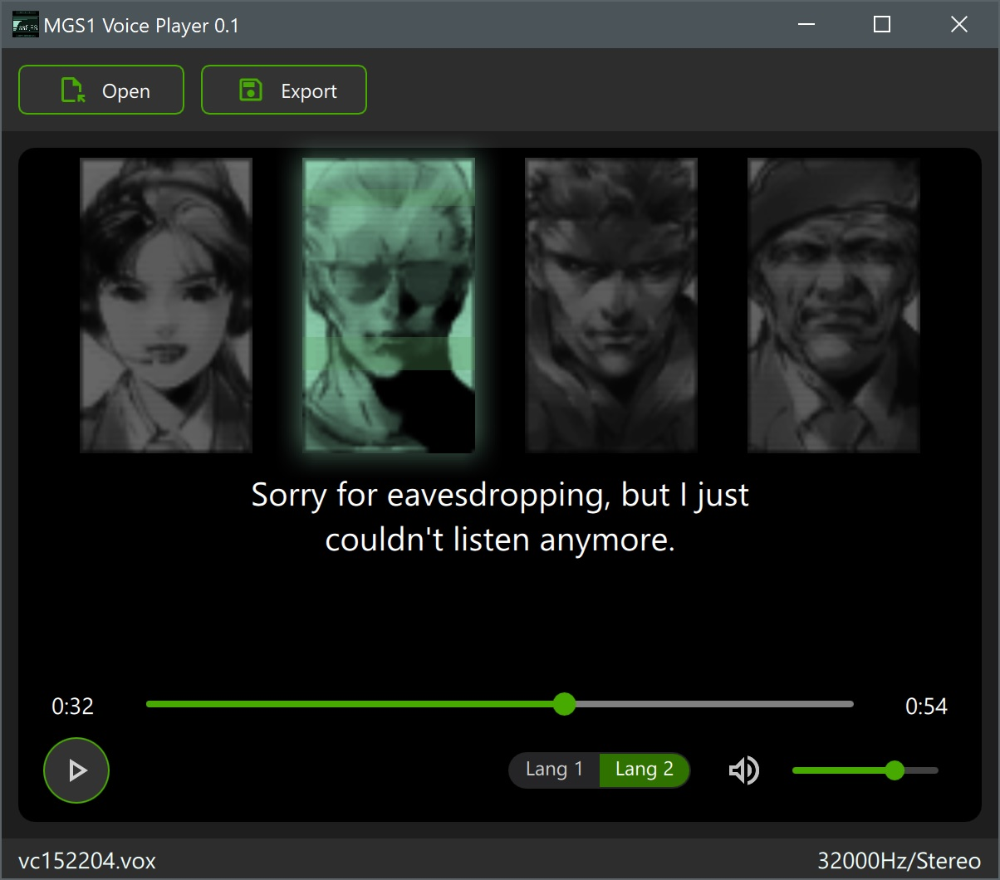

# MGS1 Voice Player

Plays voice lines from *Metal Gear Solid* PSX and PC. Supports real-time subtitle display, character portraits, and exporting audio and subtitles.

## Preview

## Features

- Open `.vox` and `.dmo` files.
- Drag & drop support.
- Media controls: play/pause, progress bar, language selection.
- Real-time subtitles with character portraits.
- Export as `.wav`, `.vag`, or `.srt`.

## Download

[Windows x64](https://github.com/g-e-o/mgs_voice_player/releases/latest)

## Installation

1. Download and extract the latest release.
2. Run `voice_player.exe`.
3. Drag and drop a `.vox` or `.dmo` file to start playback!

## License

This project is released under the **CC0 License**—do whatever you want with it!

### Qt License Notice

This application uses the **Qt framework**, which is available under the **GNU Lesser General Public License (LGPL)** version 3, or a commercial license. If you dynamically link against Qt libraries under the LGPL, you must comply with its terms, including providing a way to obtain the source code of the Qt libraries used. For more details, visit the [Qt Licensing page](https://www.qt.io/licensing/).
